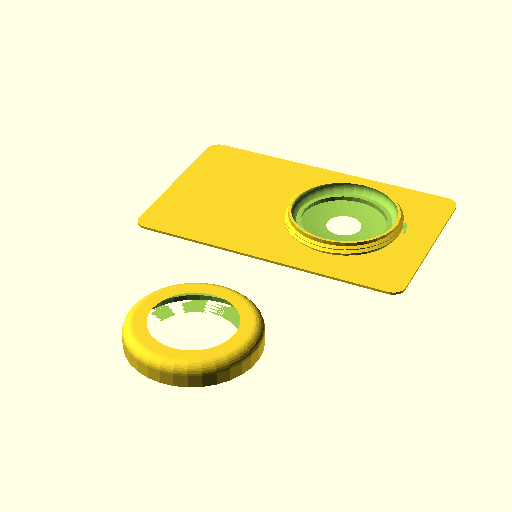

# Air Tag Adapter

An "adapter" card for attaching an airtag to wallets in the style of [decadent
minimalist's](https://decadentminimalist.com/products/dm1-aluminum).

It's really just a thin airtag case super glued to a credit card. I couldn't
find a product that worked like this, so I made one myself.

The airtag is NOT centered within the card. This allows the card to slide into
either the first or last card slot and hold the airtag in place.

[See a rendered version here](./rendered.stl).

## Attributions

Thanks to [MediaMan3D for the airtag
STL](https://www.printables.com/model/217805-apple-airtag-model).

The svg in the repository is a centered 2D projection of the linked STL.
Working with imported STLs is a bit weird but extruding a cross section is
quite pleasant.
