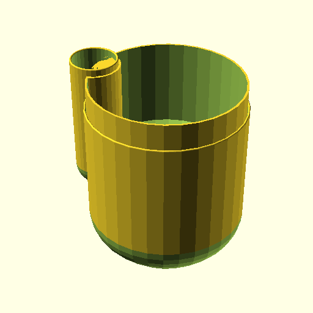

# "Self-Watering" Planter

A "Self-Watering" Planter inspired by [this model](https://www.printables.com/model/274589).

I wanted a scalable version of the above model as scaling models results in
thicker than necessary walls. Change the parameters of the (misnamed)
`resevoir` struct to the desired _internal_ dimensions.

[See a rendered version here](./rendered.stl).

<!-- /Applications/OpenSCAD.app/Contents/MacOS/OpenSCAD -o self-watering-planter/preview.png --enable fast-csg --enable fast-csg-safer --enable lazy-union self-watering-planter/planter.scad -->

## Recommended Print Setttings and Materials

I crank up wall loops to roughly match `wall_thickness` to minimize the
likelihood of infill being generated as that seems to slow down the print.

I use arachne wall generation in Bambu's slicer as that seems to generate
more efficent gcode (Speed wise).

ABS, PLA, and PETG all place nice here. Reportly, PLA may start to leak after
some time.

## TODO List
- [ ] Corrigate Walls for better structural integrity at thinner wall thicknesses
- [ ] Decorative Designs/Cut ins.
- [ ] Round the edges of the soil insert.
- [ ] Figure out how SCAD's doc strings work and document the parameters.

## Notes / Musings

The holes in the insert and ratios of the "funnel" may be a bit too large and
lead to plants drowning. We'll see and revisit as need be.
